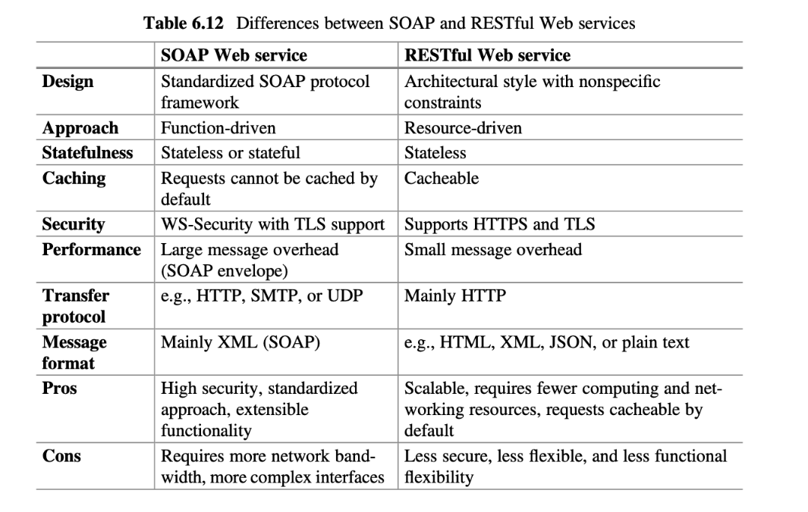

# Literaturaufgabe: Internet Computing

**Authors:** Ali Sunyaev 
**Publisher:** Springer 
**Date:** 2020

In dieser Literaturaufgabe sollten die Kapitel 1, 2, 5 und 6 des Buches *Internet Computing* gelesen und diskutiert werden.

Hier sind die Kernaussagen der einzelnen Kapitel und eigene Ideen dazu zusammengefasst. 

## Kapitel 1: Introduction to Internet Computing

In diesem Kapitel werden Definitionen (Internet Computing, Information Systems und Distributed Systems) afugestellt, die Historie und Design Challenges im Bezug auf Information Systems. Es verfügt besonders über eine wirtschaftliche Relevanz durch eine Einigung auf Kern-Design-Challenges. Eine wissenschaftliche Relevanz besteht hingegen durch reflektierte und bewertete Definitionen.

Beim Design von Anwendungen sollten auf die Kern-Challenges geachtet werden, sie nach Relevanz bewerten und anhand dessen Tools und Architektur wählen.

### Challenges
- **Reliability** 
ist die Fähigkeit eines Systems, die Aufgabe, für die es konzipiert oder vorgesehen ist, zufriedenstellend zu erfüllen

- **Scalability** 
Anpassungsfähigkeit bezüglich unterschiedlicher Nachfrage

- **Information Security** 
Verfügbarkeit, Vertrauchlichkeit, Integrität

- **Integration** 
Lose gekoppelte Systeme undabhängig vom dahinterliegenden Technologiestack

- **Interoperability** 
Kommunikation zweiter Systeme ohne, dass mans merkt.

- **Usability** 
Akzeptanz der AnwenderInnen durch Effektivität, Effizienz und Zufriedenheit

### Definitionen:

- **(Internet based) Applications**  
Anwendung (die über das Internet zur Verfügung steht) und reale Probleme löst.

- **Architectures**  
Kernkomponenten einer Anwendung und deren architekturelle Zusammensetzung

- **Technologies**  
Implementierte Lösung für ein Problem

- **Systematic Matters**  
Einflüsse auf die Anwendung (Trends, Paradigmen, ...)

## Kapitel 2: Information Systems Architecture

Ansichten (Views) von Informationssystemen

- **Logical View** 
in der alle funktionalen Anforderungen implementiert werden.
- **Process View** 
in der das Laufzeitverhalten, der Prozess und Kommunikation/Datenverarbeitung betrachtet werden.
- **Development View** 
sammelt strukturelle Anforderungen an die Programmierung und weist Arbeitspakete den einzelnen Teams zu
- **Physical View** 
welche die Hardwareanforderungen auf einer niedrigen Abstraktiosnebene beschreibt.

Das Kapitel schließt mit Erklärung von Populären Architekturmustern ab. Es werden Architekturen wie Client-Server, Tier, Peer-to-Peer, MVC und Service-Oriented vorgestellt.

### Tier

Unterteilung in drei Anwendungsebenen:
- **Presentation Layer:**  
Wie werden Informationen repräsentiert? (Im Web
z.B. HTML)
- **Application Layer:**  
Programmlogik die Informationen (weiter)verarbeitet und ausgibt

- **Data Management Layer:**  
Datenhaltung beispielsweise mit einer Datenbank

Die One-, Tow- und Three-Tier Architekturen beschrieben verschiedene Strukturierungen der Anwendungseben.

### Service Oriented Architecture (SOA)
Dienst/Infrastruktur welche Services bereitstellt um spezifische Aufgaben zu übernehmen. Dazu werden folgende Komponenten benötigt (S.46):
- service provider (Service Host)
- service broker (sagt dem requester welche Services für die Verarbeitung der Anfrage zur verfügung stehen)
- service requester (ruft Services vom Host)

## Kapitel 5: Middleware

Eine Middleware ist eine Software, die die Interaktion zwischen und das Management von Applikationen über Platformen hinweg unterstützt.

Es handlet sich bei Middlewares um anwendungsneutrale Programme. Sie verfügen selbst über keine Geschäftsprozesslogik. Im Gegenteil: Die Komplexität und Infrastruktur der hinter einer Middleware ligenden Anwendung bleibt verborgen. Eine Middleware kann außerdem als Verteilungsplattform verwendet werden.

Zu bemängeln wäre der Implementierungsoverhead der entsteht, wenn ein zusätliches Programm (Middleware) entwickelt wird. Besonders bei kleinen Projekten der der Mehraufwand mit dem Nutzen abzuwägen. Es gibt außerdem einen recht hohen Kommunikationsoverhead, was je nach Anwendungsfall ggf. nicht nötig wäre. 

Es besteht keine direkte akademische Relevanz für dieses Thema. Die Industrielle Relevanz ist beispielsweise durch den intensiven Einsatz von Middlewares bei Microservice-Architekturen gegeben. Besonders die Systemabstraktion spielt hier eine wichtige Rolle. Eine akademische Relevanz könnte sich aus der Optimierung der Architekturen ableiten (Forschung).

### Middleware-Typen
- **Message Oriented Middleware (MOM)** 
Massage Passing vs Massage Queuing
Massage Broker
Publish/Subscribe

- **Message Oriented Middleware (TOM)** 
Kommunikation zwischen heterogenen Hosts

- **Message Oriented Middleware (OOM)** 
CORBA

## Kapitel 6: Web Services

Web Services sind Programmschnittstellen, die aus dem Internet (oder über Internet-Technologien) aufgerufen werden können.

Üblicherweise wird HTTP als Protokoll zum Versand von Anfragen und Antworten (Request/Response) verwendet. HTTP dient dabei als universeller Standard, der unabhängig vom spezifischen Anwendungsfall verwendet werden kann. Generell ist das Thema Standardisierung (Response-Codes, Fehler-Code, HTTP-Verben, etc.) für Web Services höchst relevant.

Es wird XML als universelle Markupsprache vorgestellt. Leider werden keine alternative Datenabfragesprachen mit ihren jeweiligen Vor- und Nachteilen vorgestellt.

Es werden REST und SOAP Web Services verglichen. Die Zusammenfassung der Ergebnisse zeigt folgende Grafik:
