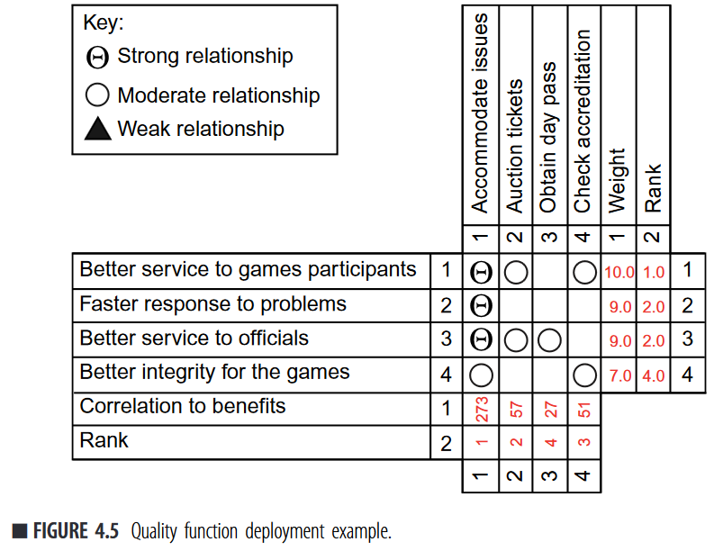

# Continuous Architecture : Sustainable Architecture in an Agile and Cloud-Centric World

**Authors:** Murat Erder, Pierre Pureur 
**Publisher:** Elsevier Science & Technology 
**Date:** 10.11.2015

In dieser Literaturaufgabe sollten die Kapitel 1, 2 und 4 des Buches *Continuous Architecture : Sustainable Architecture in an Agile and Cloud-Centric World* gelesen und diskutiert werden.

Hier sind die Kernaussagen der einzelnen Kapitel und eigene Ideen dazu zusammengefasst. 

## Kapitel 1: Introduction to Continuous Architecture

- Die Rolle SoftwarearchitektIn ist eine wichtige Rolle in Softwareprojekten. Unabhängig ob es sich um Enterprise-Anwendungen oder einfache Softwarelösungen handelt.
- **Aufgaben** von SoftwarearchitektInnen Softwarearchitekten entwerfen Modelle und Pläne. Modelle beschreiben wie eine IT-Landschaft vorher und nachher aussehehn soll. Pläne beschreiben den Weg, wie von dem einem Modell zu einem anderen gelangt werden kann. Modelle und Pläne sollen verschiedene Gruppen von Stakeholdern (sowohl Business, als auch Technologie) helfen, die technsichen Aufgaben und Umstände zu verstehen und haben deshalb einen auf die Zielgruppe zugeschnittene Vsualisierung und Detailgrad.
- Die drei primären Hürden von Softwarearchitketur heute sind:
  - Zu starker technischer Fokus; Zu wenig Fokus auf Business und Geschäftsprozesse Fokus.
  - Es besteht die Wahrnehmung, dass SoftwarearchitektInnen keine Lösungen abliefern bzw. keinen Wert im Softwareentwicklungsprozess beisteuern. Das liegt besonders daran, dass Enterpise ArchitektInnen einen Fokus auf das große Ganze haben und ihre Modelle oft wenig nutzen für die tatsächliche Umsetzung bieten.
  - Architekturmethoden können mit der steigenden Geschwindigkeit von Anforderungen und Anforderungsänderungen nicht mithalten
- **Continuous Architecture** ist ein Ansatz der die Vorteile der gut durchdachten Enterprise Architekturen mit der dynamik der agilen Softwareentwicklung vereint. Bislang gibt es keinen zufriedenstellenden Ansatz in der Softwarearchitektur mit den agilen Anforderungen (beispielsweise von Continuous Delivery) mithalten kann.
- Continuous Architecture ist eine **Sammlung von Methoden, Werkzeugen und Prinzipien**, die Softwarearchitekten auf ihren Projektkontext anwenden können.
- Continuous Architecture folgt **6 Prinzipien**:
  - Entwirf Produkte, keine Lösungen für Projekte.
  - Fokussiere qualitative Anforderungen, nicht funktionelle
  - Treffe Designentscheidungen erst dann, wenn sie absolut nötig sind
  - Entwirf einfach austauschbare Systeme
  - Betrachte neben der Softwareerstellung (Build) auch Testing und Deployment
  - Organisiere das Team so, dass es den Architekturentwürfen entspricht.

## Kapitel 2: Principles of Continuous Architecture

- **Prinzip 1: Entwerfen von Produkten** 
Produkte stellen eine Stufe der Komplexität dar, die zwischen Projekten und Enterprise Systemen liegt. Ein Produkt ist strategischer als ein Projekt. Es bezieht sich mehr auf die Business-Ziele der Organisation, als es ein Projekt macht. Außerdem ist ein Produkt nicht Zeitlich begrenzt, wie es bei Projekten der Fall ist. Es unterliegt stärkeren Anforderungsänderungen als Enterprise-Systeme, was sie deutlich dynamischer und/oder agiler macht. Es werden bei Produkten die AnwenderInnen, die Business-Ziele und die technologische Sicht vereint. Es muss ein ordentliches [Produktmanagement](#software-product-management) etabliert werden.
- **Prinzip 2: Fokus auf Qualität** 
Aus dem Anforderungskatalog werden die nicht funktionalen (qualitative) den funktionalen Anforderungen bevorzugt. Diese sind besonders wichtig, da sie von der Architektur besonders abhängig sind. Eine Architektur muss möglichst die Gesamtheit der qualitativen Anforderungen berücksichtigen, nicht nur die wichtigsten. Oft wirkt sich nämlich eine Architekurentscheidung positiv auf die eine und negative auf die andere Anforderung aus. Siehe: Architecture Tradeoff Analysis Method (ATAM)
- **Prinzip 3: Möglichst späte Designentscheidungen** 
Funktionale Anforderungen ändern sich zu beginn eines Projekts noch sehr häufig. Designentscheidungen sollten nur und erst dann getroffen werden, wenn die Fakten bekannt sind. Das Prinzip gilt auch für qualitative Anforderungen.

- **Prinzip 4: Anpassungsfähigkeit** 
Um die ständig wechselnden und entstehenden Anforderungen nachträglich in den Architekturentwurf einarbeiten zu können, werden bestimmte Vorgehensweisen benötigt. Es werden die Prinzipien der losen Kopplung und hohe Kohäsion an die Systemkomponenten gestellt. Ändert sich eine Anforderung wird eine bestehende Komponente nicht aktualisiert, sondern durch eine neue ersetzt. Das geht durch die hohe Unabhängigkeit aller komponenten. Siehe: Microservices

- **Prinzip 5: Build, Test, Deploy** 
Während klassiche Softwarearchitektur erstmal nur den Build-Step im Lebenszyklus einer Software betrachtet, sollten bei Continuous Architecture auch die Test und Deploy Schritte betrachtet werden. Es können besondere Anforderungen für diese anderen Prozessschritte existieren. User Stories helfen diese zu identifizieren. In der Praxis könnten diese Anforderungen durch den Einsatz von APIs und Service Virtualisierung (Containerisierung) erreicht werden.

- **Prinzip 6: Teamorganisation nach Architektur** 
Bei der Betrachtung des Teams ist es wichtig Prinzip 5 zu beachten. Personen aus Build/Design sind genauso wichtig wie aus Test und Deploy. Zusammenarbeit ist ein Schlüsselprinzip für Continuous Architecture. Nach Conways Law sollten die Teams nicht in Front-End; Back-End; Datenbanken usw eingeteilt werden. Um Kommunikation zu verbessern sollten Teams nach Fähigkeiten oder Produkt-Feature erstellt werden.

## Kapitel 4: Evolving the Architecture
- ArchitektInnen sollten nicht Diagramme, Modelle oder einen Prototypen als ihre Hauptaufgabe sehen. Viel zentraler sind ihre Architekturentscheidungen (Architecture Decisions).
- Eine Architekturentscheidung beinhaltet
  - Alle Einschränkungen, die sie definiert
  - Auswirkung (auch auf die qualitativen Anforderungen)
  - Alle Optionen, die zu Verfügung standen
  - Der Entscheidungsweg, warum eine option gewählt wurde
- Architekturentscheidungen können übergreifend dokumentiert und visualisiert werden, sodass die Entschiedungen erst getroffen werden müssen, wenn alle Fakten klar sind. Erstellung eines öffentlich sichtbaren **Architecture Backlogs**. 
- Architekturentscheidungn können an die umsetzenden Teams abgegebn werden. Auch hier ist Kommunikation ein zentraler Faktor.
- Architekturentscheidungen können und sollten Priorisiert werden. Dabei hilft gegebenenfalls **Quality Function Deployment** (QFD), eine Six Sigma Technik. Dabei werden allen Anforderungen gewichtete Benefits zugeordnet. Eine Zuordnung bzw ein Zusammenhang kann STARK, MODERAT und SCHWACH sein. Die Anforderung mit dem höchsten Score erhält entsprechend Priorität 1. Siehe Abbildung. Das Buch führt weiterhin eine komplette Erstellung einer QFD auf.

- Transitionen zwischen zwei Architekturen / Zuständen sind zu beschreiben. Eine Methode zur Beschreibung des Wegs ist es, zusätzliche Transitions-Zustände zu modelieren. Ein Transitionszustand ist immer der mittlere Zustand zwischen zwei Zuständen. Diese Methode lässt sich rekursiv beliebig anwenden, was einen beliebig detailliertes Ergebnis erzeugen kann.  
- Das Modell von Plateaus und Wellen ist das Pendant zu Sprints. Plateaus müssen erreicht werden, in denen das Softwaresystem funktioniert. Dazwischen können mit Hilfe von Waves Änderungen implementiert werden. In einer Wave werden einzelne Komponenten ausgetauscht. Auch hierzu bietet das Buch eine komplette Planerstellung an einem praktischen Beispiel.
## Glossar
### Software product management
> Software product management is the process of managing
software that is built and implemented as a product, taking into
account life-cycle considerations and generally with a wide
audience. It is the discipline and business process which governs
a product from its inception to the market or customer delivery
and service in order to generate biggest possible value to the
business. This is in contrast to software that is delivered in an ad
hoc manner, typically to a limited clientele, e.g. service.

### Architecture Tradeoff Analysis Method (ATAM)
### Microservices

  
Nicht mehr verwendete Zusammenfassungen

Die Rolle der SoftwarearchitektInnen ist, wie viele andere Rollen in der Softwareentwicklung, nicht genau definiert. Oft werden SoftwarearchitektInnen als eine überflüssige Rolle angesehen. Die etwas zynische Frage: "Was machen/können SoftwarearchitektInnen, was EntwicklerInnen nicht könnten?" wird indirekt gestellt.

Die Autoren nennen ein imaginäres Pendel, das weg von den gut durchdachten Enterprise Architekturen hin zu schneller entworfenen, dynamischeren Architektureentwürfen schwingt. Die Autoren gehen nicht davon aus, dass das Pendel zurück zu Enterprise Architekturen schwingt. Sie vertreten die Ansicht, dass Architekturplanung nicht verloren geht. Sie sagen, dass sich der Architekturentwurfprozess *nur* an die neuen Anforderungen anpassen muss.

Praktisch:
Die Frage, was Softwarearchitekturen ist lässt sich einfacher durch die Frage: "Warum werden Softwarearchitekturen geplant?" beantwortet.

- Definieren von richtungsweisende Prinzipien und Standards
- Entwicklen von Architekturmodellen
- Aufbauen und beschreiben von Services und Schnittstellen zwischen diesen.
- Entwerfen von Roadmaps/Plänen zur erfolgreichen Implementation von IT Blueprints.

Es wird auch die historische Perspektive von Softwarearchitekturen betrachtet. Dafür beschreibt folgendes Bild aus dem Buch bereits gut die genannten Aspekte. Es werden eingesetzte Technologien und eingesetzte Architekturprinzipien auf einem Zeitstrahl dargestellt. Außerdem ist wichtig zu erwähnen, dass nahezu alle genannten Technologien und Architekturen heute noch verwndet werden. Die Autoren bezeichnen sie nicht als veraltet. Es gibt heutzutage nur weniger Anforderungen, die diese erfordern. 

Zwischen agilen EntwicklerInnen, die frühstmögliche Umsetzung der Anfordeungen bevorzugen wollen und Enterprise ArchitektInnen, die einen möglichst 

