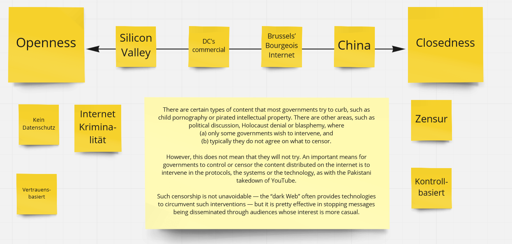

# Literaturaufgabe:  Four Internets: The Geopolitics of Digital Governance

**Authors:** Kieron O’Hara and Wendy Hall 
**Date:** 2018

In dieser Literaturaufgabe sollte das Paper *Four Internets: The Geopolitics of Digital Governance* gelesen und diskutiert werden.

Hier sind die Kernaussagen des Papers und eigene Ideen dazu zusammengefasst. 

Es werden die vier Hauptrichtungen vorgestellt, in die sich das Internet entwickeln könnte.
Diese unterschiedlchen Sichten führen zu einer ungleichen Koexistenz mehrerer Netze. Es wurde noch kein Gleichgewicht erreicht. Wir müssen darauf vorbereitet sein, dass das Internet, das wir kennen, sich unvorhersehbar entwickelt, um sicherzustellen, sodass es für die Menschheit nützlich bleibt. Hier ist darauf zu achten, dass diese Prognosen nicht belegt werden können. Es kann auch sein, dass es so nicht eintrifft. Selbst die aktuelle SItuationsbeschreibung ist kritisch zu hinterfragen, da *das Internet* ohnehin in stetigem Wandel ist. Egal wo auf der Welt.

Dennoch verfügt das Thema über eine große Relevanz für unseren Alltag. Die Entwicklung des Internets bestimmt weitreichende Bereiche des zukünftigen Lebens. Sowohl beruflich, als auch persönlich. Unser politisches Mitwirken hat großen Einfluss auf die Entwicklung.

- **Silicon Valley's Open Internet**  
Das internet der Technologie. Es wird ein hohes Maß an Netzneutralität gefordert um Freiheit für jeden Netzteilnehmer zu gewährleisten.
- **DC’s Commercial Internet**  
Das Internet als privates Eigentum, das monetarisiert werden kann.
- **Brussels' Bourgeois Internet**  
Trolling und schlechtes Verhalten werden bekämpft und die Privatsphäre geschützt, gegebenenfalls auf Kosten der Innovation. Siehe DSGVO.
- **Beijing's Authoritarian Internet**  
Ein Netz das sich durch Überwachung und Identifikation auszeichnet. Es ist sehr Regierungsgesteuert aber es bietet eine große Datenbasis als Grundlage für Verwertung in Wissenschaft und Fortschritt.
- **(Moscow's Spoiler Model/Free Rider)**  
Die Offenheit des Internets wird als Schwachstelle gesehen und für falsche Informationsverbreitungund und Hacking ausgenutzt.

Die Einordnungen der Autoren sind meiner Ansicht nach recht populistisch dargestellt. Der Informationsgehalt sollte von der lesenden Person definitiv hinterfragt und selbst bewertet werden.

In folgendem Bild wurden von uns die verschiedenen Internet-Ausprägungen auf ihre Offen- bzw. Geschlossenheit sortiert.

