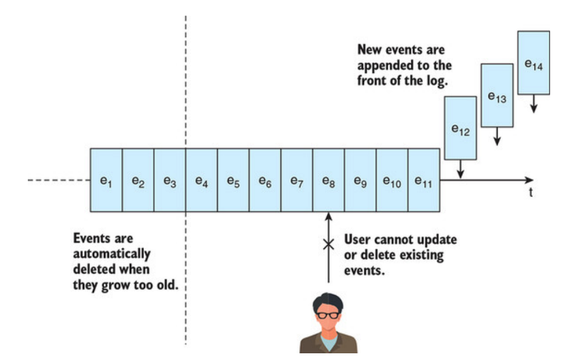

# Literaturaufgabe:  Event Streams in Action : Real-time Event Systems with Kafka and Kinesis

**Authors:** Valentin Crettaz, Alexander Dean 
**Publisher:** Manning Publications 
**Date:** 2019

In dieser Literaturaufgabe sollten die Kapitel 1, 2 und 3 des Buches *Event Streams in Action : Real-time Event Systems with Kafka and Kinesis* gelesen und diskutiert werden.

Hier sind die Kernaussagen der einzelnen Kapitel und eigene Ideen dazu zusammengefasst. 

## Kapitel 1: Introducing event streams

- Einführung von Definitionen und grundlegenden Konzepten.
- Ein **Event** ist alles was zu einem bestimmten Zeitpunkt beobachtet werden kann.
- Ein **Event Stream** ist eine Abfolge von Events, die Zeitlich unbegrenzt ist.

In der Softwareentwicklung werden Event Streams zeitlich in drei Kategorien eingeordnet:

- **Classic Era** 
Besteht aus einfachen Strukturen. Ein Datawarehouse (große Datenbank) für alle Daten mit Point-to-point connection.
- **Hybrid Era** 
Daten liegen nun auf verschiedenen Datawarehouses(on-premises & SaaS). Daten können von verschiedenen Orten / Geräten abgerufen werden. Die vorher verwendeten Point-to-point Verbindungen haben mit der Datenmenge zugenommen und sind unvollständig/fragil.
- **Unified Era** 
Durch den Einsatz von (write-only) unified logs sind simultane Bearbeitung/Verarbeitung möglich geworden. Das Lesen der Daten funktioniert mit besonders niedriger Latenz-Zeit.

Das Thema verfügt über eine akademische Relevanz, da es Erlaubt Metaanalysen auf *echte* Unternehmensdaten (live) in Systemen wie z.B. produzierende Unternehmen durchzuführen.

Entsprechend ist die industrielle Relevanz noch höher. Unified Logs erlauben eine leichtere Kopplungen von Systemen, die wiederrum besser skalieren. Auch die Unternehmen erhalten bessere Monitoring-Möglichkeiten. Durch write only besteht eine besonders hohe Auditsicherheit.

## Kapitel 2: The unified log

In diesem kapitel werden Unified Logs detailliert eingeführt, Das Schema ist dabei technologieoffen gelassen (JSON, XML, ...). Uniefied Logs verwenden neben Write-Only auch das Append-Only-Verfahren. Events sollen nicht mehr manipuliert werden. Ältere Events werden nach einer vorher eingestellten Zeit automatisiert gelöscht. Alle Softwareprodukte können simultan auf das unified log zentralisiert zugreifen.

Skalierbarkeit:
- Events sind einzigartig und genau adressierbar
- Nachrichtenflüsse lassen sich durch Shards duplizieren. So wird eine Duplikation der Daten ermöglicht um besser zu skalieren.
- Event-Partitionen erlauben das aufteilen der Daten auf verschiedenen Server ohne die Reihenfolge zu verlieren.

Es ist anzumerken, dass ausschließlich auf Kafka als Event-Stream-Plattform eingegangen wurde. Es sollten andere Tools nachträglich überprüft werden.

Das Thema Event-Streams war für mich komplett neu. Es ist ein sehr interessanter Ansatz für den Informationsfluss in mittelgroßen und großen Unternehmen. Besonders praktisch ist, dass Events nach und nach in den Event-Stream übernommen werden können.

