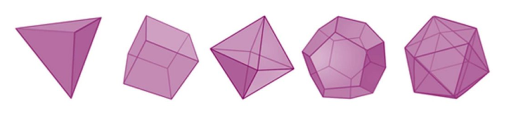

# Vorstellung zwei eigener Projekte

**Zum [14.10.2021](2021-2021-10-14.md)**

Vorstellung 2 eigener Web-Projekte (Studium, Arbeit, Privat)
Interessant könnte z.B. ein problematisches und ein erfolgreiches Projekt sein.
Sie können sich an folgenden Fragen orientieren:
- In welchem Kontext ist das Projekt entstanden?
- Welches Problem sollte mit dem Projekt gelöst werden?
- Was war am Produkt oder Prozess besonders positiv/negativ?
- Wie sah die Architektur und die Technologie des Produktes aus?
- Was würden Sie beim nächsten Projekt anders machen und warum?
Vortragsdauer: ~10min

## Ergebnisse

### Cranach Cross Fade
Das Projekt *Cranach Cross Fade*  ist ein im ersten Semester der Medieninformatik Masters durchgeführtes Projekt. Es ist Teil des Studienverlaufplans und eine Prüfungsleistung. Die Projektidee wurde von einem anderen Team aus vorherigen Semestern in Kooperation mit Professor Christin Noss und dem [Cranach Digital Archive](https://lucascranach.org/) (CDA) entworfen und sollte dann technisch geplant und implementiert werden. 

Das CDA stellt auf ihrer Website hochauflösende Aufnahmen von Werken von Lucas Cranach und seiner Familie und Werkstatt bereit. Kunstwissenschaftler und Kunstinteressierte haben dort die möglichkeit diese Hochauflösenden Aufnahmen einzeln zu betrachten. Zu den verschiedenen Aufnahmen eines Werks können auch Infrarot- und Röntgen-Aufnahmen zählen. Außerdem können sich Aufnahmen, die zu einer anderen Zeit aufgenommen wurden unterschieden. 

Um diese zahlreichen Aufnahmen verschiedener Zeiten und Methoden miteinander zu vergleichen, sollte eine Anwendung entwickelt werden die es elaubt, mehrere Aufnahmen (wie auf einem Leuchttisch) übereinander zu legen und dabei verschiedene Durchsichtigkeiten einzustellen.

Bei der Erstellung des Architekturentwurfs wurden Architecture Decision Records (ADRs) verwendet. 

Tech stack:
- Frontend
  - Vue.js
  - TypeScript
  - Openseadragon (Image Viewer)
- Backend
  - Node.js
  - Express
- Datenbank
  - MongoDB
- CI/CD
  - GitHub
  - GitHub Actions
  - Mocha
  - Docker
### Chronometer

Chronometer ist ein Praxisprojekt des Informatikstudiums (Bachelor) an der TH Köln. Es wurde in Kooperation mit der [VOSS Automotive GmbH](https://www.voss-automotive.net/index.html)(VOSS) geplant und durchgeführt.

Die IT-Abteilung von VOSS hat ca. 80 MitarbeiterInnen die alle an Projekten arbeiten. Damit das Projektmanagement-Team dieser Projekte fundierte Entscheidungen auf basis von Fakten treffen kann, werden im Lebenszyklus eines Projhektes immer wieder Daten erfasst. Dazu zählen auch Time-Tracking-Daten, bei denen die MitarbeiterInnen ihre Arbeitszeiten an einem Projekt protokollieren. Das passiert bislang über ein älteres Softwaresystem, das einen recht hohen Mehraufwand zum Erfassung von Arbeitszeiten für die MitarbeiterInnen bedeutet. Dadurch kommt es vor, dass MitarbeiterInnen es bevorzugonen einmal pro Woche oder einmal pro Monat die Arbeitszeiten zu schätzen statt sie direkt einzutragen. Diese Schätzungen führen zu Ungenauigkeiten und verfälschen die Informationsbasis, auf der das Projektmanagement seine Entscheidungen begründet. 

Mit dem Chronometer soll ein IoT-Gerät entwickelt werden, dass das Erfassen der Arbeitszeiten spielerisch leicht macht. Ein Polyeder (mehrflächiger Körper) soll ständig auf dem Schreibtisch des Mitarbeiters/der Mitarbeiterin liegen und erkennen, wenn dieser auf eine andere Fläche/Seite gelegt wird. Jeder Fläche kann ein Projekt zugeordnet werden und sobald die konfigurierte fläche oben liegt, beginnt das Gadget die Zeit zu messen. Sobald das Gadget auf eine andere Seite gelegt wird, registriert es automatisch die gemessene Zeit auf das entsprechende Projekt. 

Tech stack:
- Gadget
  - Adafruit All-In-One Microcontroller Board
  - Arduino
- Front-end
  - Vue.js
  - Mosquitto
  - http-calls / REST-API
- Message Broker