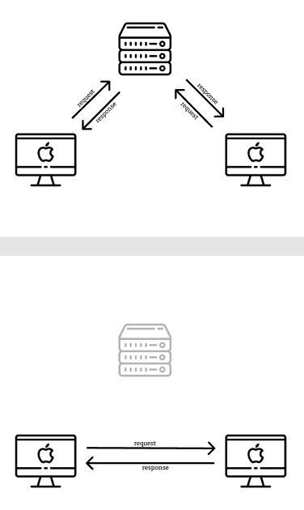

# Vorstellung: Peer to peer - Decentralized Architecture
Kurze Übersicht über eine Technologie, ein Konzept oder ein Pattern, welches ihr noch nicht aktiv in Projekten verwendet habt, welches jedoch in euren Augen viel Potential besitzt

Ausgewähltes Thema: **Peer to peer - decentralized architecture**

**In welchem Zusammenhang ist es euch begegnet?**  
Peer to peer Netzwerke sind mir bereits länger bekannt gewesen. Zum einen *aus dem Lehrbuch* in Ausbildung und Studium, wobei es meistens um Netzwerktopologien ging und selten um P2P in Kombination mit dem Internet. Im Zusammenhang mit dem Internet und Web-Applikationen ist mir P2P zu erst (wissentlich) mit dem Thema WebRTC begegnet. WebRTC wird eingesetzt um z.B. in Web-basierten Anwendungen (Discord, Slack, etc.) Audio- und Videoanrufe zu ermöglichen. 

**Was hat euer Interesse geweckt?**  
Entwirft oder Entwickelt man eine Softwarearchitektur, kamen mir quasi nie P2P-Technologien in den Sinn. Dafür sind Client-Server-Architekturen viel zu vielseitig und präsent. Mich haben besonders die Einsatzbereiche Interessiert, in denen bislang noch nicht oder kaum P2P-Lösungen existieren. Eine *Dropbox* in einem P2P-Netz? Oder ein soziales Netzwerk in dem jeder die Profile seiner Freunde teilt? Ich hatte das Gefühl, dass die klassische P2P-Technologie in den letzten Jahren etwas untergegangen ist. Vielleicht gibt es neue Anwendungsfelder, in denen der Einsatz durchaus sinnvoll ist. Blockchain verwendet grundlegende P2P-Konzepte, wodurch das Thema für das Web 3.0 besonders interessant ist/sein wird.

**Eisatzmöglichkeiten**  
- 1:1 echtzeit Kommunikation im Internet (Audio, Video, Screen Sharing)
- Dezentralisierte Services (z.B. File Sharing)

**Welches Problem löst die Technologie, das Konzept oder das Pattern?**  
Im Zusammenhang mit dezentralisierten Technologien immer wieder genannt werden die Punkte Datensicherheit, Datenschutz und Anonymität im Netz. Durch die direkte Kommunikation zweiter Parteien fällt eine dritte Dienstleisterpartei weg. Es muss also keiner dritten Partei vertraut werden - Stichwort: **Trust**.

Verschlüsselung im Internet ist noch nicht in allen Bereichen im Einsatz. P2P setzt *grundlegend* auf kryptographische Verfahren, da die rohen Daten in dezentralisierten Softwaresystemen öffentlich zugänglich sind.

**Was sind die Kernaspekte?**  

- Kommunikation direkt mit dem Kommunikationspartner
- Kryptographie als essentieller Baustein

Für Anwendungen im Web stehen gute APIs und Frameworks zu Verfügung. Im Folgenden ein paar Beispiele:
- [WebRTC](https://webrtc.org/)
- [PeerJS (Abstraktion von WebRTC)](https://peerjs.com/)
- [GUN](https://gun.eco/)

**Welche Kritikpunkte gibt es?**  
Dadurch, dass keine dedizierte Infrastruktur für dezentralisierte P2P-Anwendung existieren, müssen besondere Maßnahmen bezüglich der *Verfügbarkeit* getroffen werden. Da es in einem netz keinen Single Point of Truth gibt, sind auch *inkonsistente Daten* möglich. Eine gute Skalierbarkeit von P2P-Anwendungen wurde bisher nicht sichergestellt. Für diese Kritikpunkte müssen spezielle Technologien eingesetzt werden, die im Standard ggf. nicht zu einer typischen P2P-Architektur gehören.

**Welche verwandte Technologien, Konzepte oder Pattern existieren?**  
- dapps: Dezentralisierte Anwendungen auf basis von Blockchain
- torrents: Bereits viel verwendete Technologie für File-Sharing 

**Wo würdet ihr es einsetzen?**  
- Kleine Hobby-Projekte wie digitale Gesellschaftsspiele. Dadurch, dass kein Server benötigt wird (besonders wenn die Netzwerkteilnehmer im gleichen Netzwerk sind), fällt Entwicklungsaufwand und Wartungsaufwand für die Server-Komponente weg.
- Anwendungsfällen, die eine P2P-Kommunikation hergeben. Ich nehme mir vor bei den nächsten Anforderungen etwas über den Tellerrand zu schauen und zu prüfen, ob P2P eine (Teil-)Alternative sein kann.